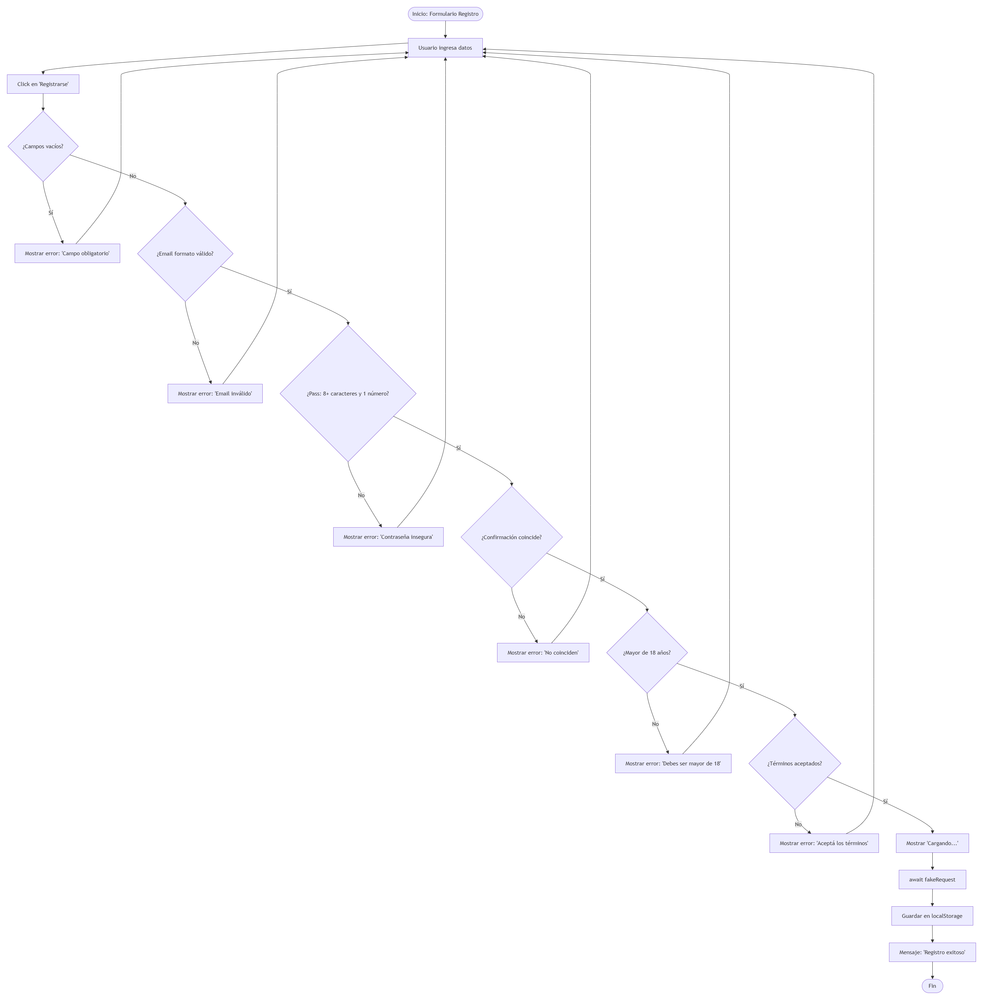
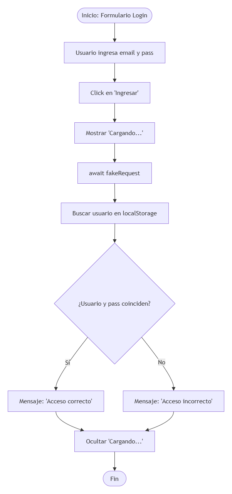

# Parcial Programación 3 - Registro y Autenticación de Usuarios

Proyecto desarrollado para la carrera de Desarrollo de Software, Programación 3 de tercer año.

## Descripción del Proyecto
Sistema de registro y autenticación de usuarios implementado con tecnologías frontend (HTML, CSS, JavaScript). 
Utiliza localStorage para la persistencia de datos y simula un entorno asincrónico mediante async/await para el manejo de peticiones.

## Instrucciones de ejecución
1. Clonar o descargar el repositorio.
2. Abrir la carpeta en un editor de código (como VS Code).
3. Abrir el archivo index.html

## Usuario de prueba
Para verificar el login, puedes usar:
- **Email:** `karim@test.com`
- **Contraseña:** `password123`

## Diagramas de Flujo

### Proceso de Registro

### Proceso de Login
